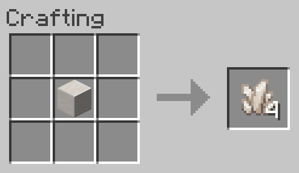

# Block of Quartz to Nether Quartz
Allows a Block of Quartz to be converted back into 4 Nether Quartz.

**NOTE:** This recipe is shapeless, the inputs may be placed in any arrangement in the crafting grid.

## Ingredients
* 1 [Block of Quartz](https://minecraft.gamepedia.com/Block_of_Quartz)

## Result
* 4 [Nether Quartz](https://minecraft.gamepedia.com/Nether_Quartz)

## Recipe
