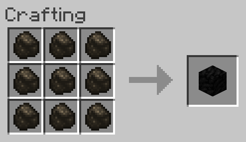

# Charcoal to Coal
Allows 9 Charcoal to be converted into 1 Block of Coal.

## Ingredients
* 9 [Charcoal](https://minecraft.gamepedia.com/Charcoal)

## Result
* 1 [Block of Coal](https://minecraft.gamepedia.com/Block_of_Coal)

## Recipe
