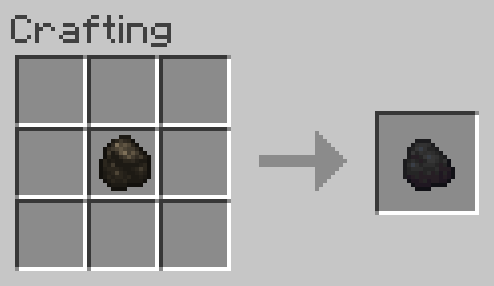

# Charcoal to Coal
Allows Charcoal to be converted into 1 Coal.

**NOTE:** This recipe is shapeless, the inputs may be placed in any arrangement in the crafting grid.

## Ingredients
* 1 [Charcoal](https://minecraft.gamepedia.com/Charcoal)

## Result
* 1 [Coal](https://minecraft.gamepedia.com/Coal)

## Recipe
