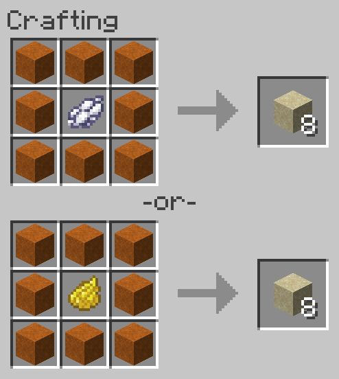

# Dye Red Sand to Sand
Allows dyeing Red Sand to regular Sand.

**NOTE:** This recipe is shapeless, the inputs may be placed in any arrangement in the crafting grid.

## Ingredients
* 8 [Red Sand](https://minecraft.gamepedia.com/Red_Sand)
* 1 [White Dye](https://minecraft.gamepedia.com/White_Dye) **or** 1 [Yellow Dye](https://minecraft.gamepedia.com/Yellow_Dye)

## Result
* 8 [Sand](https://minecraft.gamepedia.com/Sand)

## Recipe
