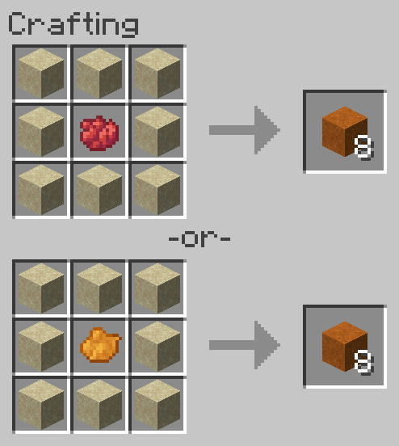

# Dye Sand to Red Sand
Allows dyeing regular Sand to Red Sand.

**NOTE:** This recipe is shapeless, the inputs may be placed in any arrangement in the crafting grid.

## Ingredients
* 8 [Sand](https://minecraft.gamepedia.com/Sand)
* 1 [Red Dye](https://minecraft.gamepedia.com/Red_Dye) **or** 1 [Orange Dye](https://minecraft.gamepedia.com/Orange_Dye)

## Result
* 8 [Red_Sand](https://minecraft.gamepedia.com/Red_Sand)

## Recipe
