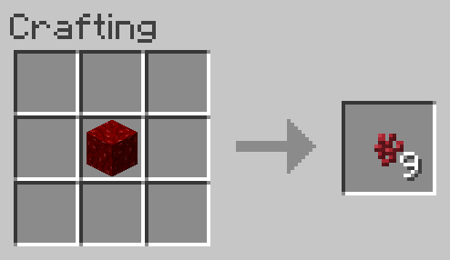

# Nether Wart Block to Nether Wart
Allows a Nether Wart Block to be converted back into 9 Nether Wart.

**NOTE:** This recipe is shapeless, the inputs may be placed in any arrangement in the crafting grid.

## Ingredients
* 1 [Nether Wart Block](https://minecraft.gamepedia.com/Nether_Wart_Block)

## Result
* 9 [Nether Wart](https://minecraft.gamepedia.com/Nether_Wart)

## Recipe
