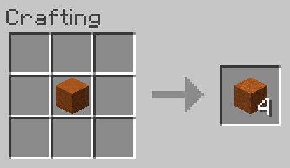

# Red Sandstone to Red Sand
Allows Red Sandstone to be converted back into 4 Red Sand.

**NOTE:** This recipe is shapeless, the inputs may be placed in any arrangement in the crafting grid.

## Ingredients
* 1 [Red Sandstone](https://minecraft.gamepedia.com/Red_Sandstone)

## Result
* 4 [Red Sand](https://minecraft.gamepedia.com/Red_Sand)

## Recipe
