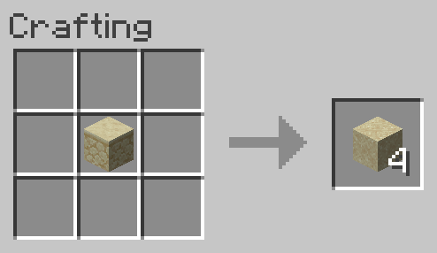

# Sandstone to Sand
Allows Sandstone to be converted back into 4 Sand.

**NOTE:** This recipe is shapeless, the inputs may be placed in any arrangement in the crafting grid.

## Ingredients
* 1 [Sandstone](https://minecraft.gamepedia.com/Sandstone)

## Result
* 4 [Sand](https://minecraft.gamepedia.com/Sand)

## Recipe
