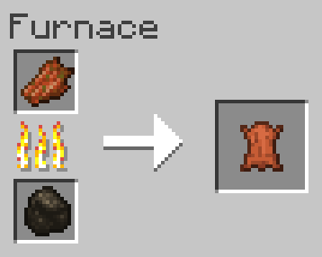

# Smelt Rotten Flesh to Leather
Allows Rotten Flesh to be smelted in a furnace into Leather.

## Ingredients
* 1 [Rotten Flesh](https://minecraft.gamepedia.com/Rotten_Flesh)

## Result
* 1 [Leather](https://minecraft.gamepedia.com/Leather)

## Recipe
