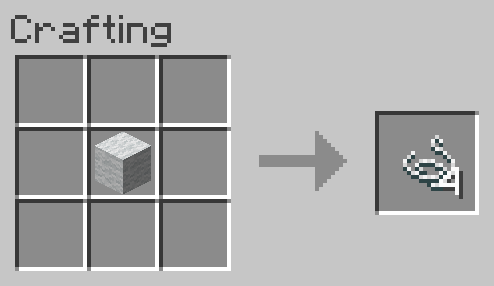

# Wool to String
Allows Wool (of any color) to be converted back into 4 String.

**NOTE:** This recipe is shapeless, the inputs may be placed in any arrangement in the crafting grid.

## Ingredients
* 1 [Wool](https://minecraft.gamepedia.com/Wool) (of any color)

## Result
* 4 [String](https://minecraft.gamepedia.com/String)

## Recipe
